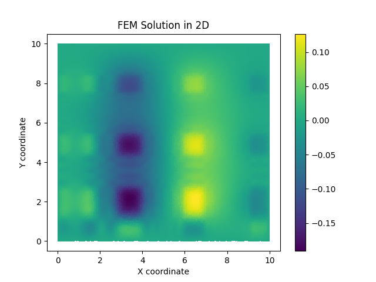
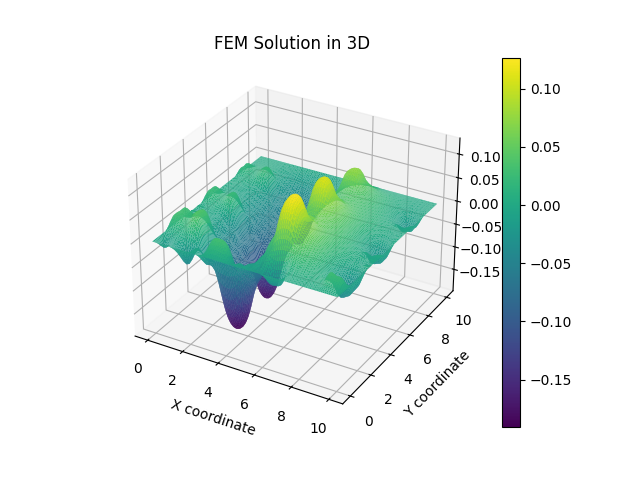

# Finite Element Method (FEM) for Poisson's Equation

This repository contains an implementation of the Finite Element Method (FEM) to solve the Poisson equation on a 
rectangular domain. The code is written in Python, utilizing NumPy, SciPy and Matplotlib for calculations and 
visualizations.

## Overview

The Finite Element Method (FEM) is a numerical technique used to approximate solutions to boundary value problems for 
partial differential equations (PDEs). It subdivides a large problem into smaller, simpler parts that are called finite 
elements.

This project specifically addresses the Poisson equation, commonly used in electromagnetism, fluid dynamics, and other 
fields.

## Project Structure

- `get_nodes_and_triangles`: generates the mesh of nodes and triangles for the specified domain.
- `get_local_stiffness_matrix`: computes the local stiffness matrix for a single triangular element.
- `get_global_stiffness_matrix`: assembles the local stiffness matrices into a global stiffness matrix.
- `get_boundary_nodes`: identifies nodes at the boundary of the domain to apply boundary conditions.
- `apply_boundary_conditions`: modifies the global stiffness matrix to enforce zero potential at the boundaries.
- `construct_rhs`: constructs the right-hand side vector that represents the source terms.
- `solve_fem_system`: solves the linear system using sparse matrix techniques.
- `plot_solution_2D` and `plot_solution_3D`: Visualize the solution in 2D and 3D, respectively.

## Step-by-Step Guide

### Step 1: Mesh Generation

**Theory**: the domain is divided into a finite number of small elements, typically triangles, which together form a 
mesh. Each point where elements meet is called a node.

**Explanation**: think of this as cutting a piece of paper into tiny triangles. Each corner or point where the cuts 
meet is important because it helps us describe the shape of the paper.

### Step 2: Local Stiffness Matrix

**Theory**: for each triangle, a local stiffness matrix is calculated based on the triangle's geometry and the physics 
of the problem. This matrix describes how the triangle's points (nodes) interact with each other mechanically.

**Explanation**: imagine each triangle as a mini trampoline. When you press down on one corner, the other corners react.
The local stiffness matrix tells us how much each corner affects the others.

### Step 3: Global Stiffness Matrix

**Theory**: the local stiffness matrices are assembled into a global matrix that represents the entire mesh. This step 
involves placing each local matrix into the global matrix according to the triangles' connections.

**Explanation**: now, connect all the mini trampolines together according to how the triangles touch each other. The 
global matrix tells us how pressing on any point of the entire mesh affects every other point.

### Step 4: Boundary Conditions

**Theory**: Boundary conditions are applied to the global stiffness matrix to reflect the physical constraints of the 
problem, such as fixed potentials at the boundaries.

**Explanation**: If the edges of the paper are taped down, those points can't move. We adjust our calculations to keep 
these points fixed.

### Step 5: Solve the Linear System

**Theory**: The linear system, formed by the global stiffness matrix and the right-hand side vector (representing 
external forces or sources), is solved to find the potentials at each node.

**Explanation**: We now solve a big puzzle. Given the stiffness of each part and the forces applied, we find out how 
much each node moves or what its potential is.

### Step 6: Visualization

**Theory**: The potentials at the nodes are visualized over the domain to analyze the behavior of the solution.

**Explanation**: We draw a map showing how high or low each point on the paper is, using colors to show different 
heights or potentials.

## Example Plots

These images show the results of the Finite Element Method simulation: the left image represents the 2D plot of the 
solution, and the right image represents the 3D plot of the solution.

  
   

